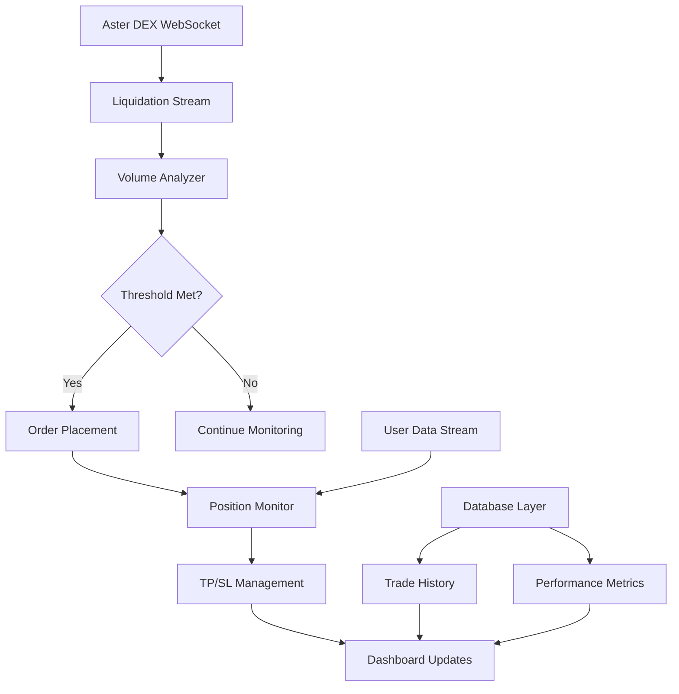

<div align="center">
  

  # Liquidation Hunter Bot

  🚀 Advanced Cryptocurrency Trading Bot for Aster DEX
</div>

[](https://www.python.org/downloads/)
[](LICENSE)
[](https://github.com/CryptoGnome/aster_lick_hunter)
[](http://localhost:5000)
[](https://discord.gg/P8Ev3Up)

## 💝 Support Development - This Bot is 100% FREE!

**This bot is completely free and open-source!** If you find it useful and want to support ongoing development, please consider creating your Aster DEX account using our referral link:

### 👉 [**Create Aster DEX Account - Support Development**](https://www.asterdex.com/en/referral/3TixB2)

*By using this referral link for your new account, you help fund continued improvements and new features while getting the exact same trading conditions. Thank you for your support!*

---

## 🎯 What is This Bot?

The **Aster Liquidation Hunter Bot** is an automated trading system that:
- 🔍 **Monitors** cryptocurrency liquidations in real-time
- 📊 **Analyzes** market conditions automatically
- 💰 **Executes** profitable counter-trades
- 🛡️ **Manages** risk with automated stop-loss and take-profit

Think of it as your automated trading assistant that watches the market 24/7 and trades when big liquidations happen!

### 📹 Video Tutorial - Click to Play

[](https://youtu.be/MuHPrGIn7GI)

## ⚡ Quick Start (5 Minutes!)

### For Complete Beginners
If you're new to programming or trading bots, we have a special guide just for you:
👉 **[CLICK HERE FOR BEGINNER'S GUIDE](QUICKSTART.md)** 👈

### For Experienced Users

```bash
# 1. Clone the repository
git clone https://github.com/CryptoGnome/aster_lick_hunter.git
cd aster_lick_hunter

# 2. Install Python dependencies
pip install -r requirements.txt

# 3. Set up your API keys
cp .env.example .env
# Edit .env with your API credentials

# 4. Run the bot
python launcher.py

# 5. Open dashboard
# Navigate to http://localhost:5000
```

## 📊 Dashboard Preview


## 🌟 Key Features

### 🤖 Automated Trading
- **Real-time Liquidation Monitoring** - Connects directly to Aster DEX liquidation stream
- **Smart Trade Execution** - Analyzes order books for optimal entry prices
- **Volume-Based Triggers** - Only trades when liquidations exceed your thresholds
- **Opposite Trading** - Takes the opposite side of liquidations (contrarian strategy)

### 🛡️ Risk Management
- **Automated Stop-Loss & Take-Profit** - Every trade is protected automatically
- **Position Size Limits** - Never risk more than you configure
- **Maximum Exposure Control** - Limits total capital at risk
- **Hedge Mode Support** - Manage LONG and SHORT positions separately

### 📈 Advanced Features

#### 🆕 Position Monitor System
- **Unified TP/SL Management** - Centralized control of all protective orders
- **Real-time Price Monitoring** - WebSocket-based instant price tracking
- **Instant Profit Capture** - Closes positions immediately when profit targets are exceeded
- **Thread-Safe Operations** - Re-entrant lock protection for reliability

#### 🆕 Intelligent Tranche System
- **Dynamic Position Scaling** - Automatically splits positions into tranches
- **Loss-Based Triggers** - Creates new tranches at configurable loss thresholds
- **Profit Optimization** - Merges profitable tranches to maximize capital efficiency
- **Risk Limiting** - Maximum tranches per symbol/side for controlled exposure

#### 🆕 Order Batching & Buffering
- **Batch Order Submission** - Combines multiple orders for efficiency
- **Liquidation Buffering** - Collects liquidations before processing
- **API Rate Optimization** - Reduces API calls by up to 70%
- **Configurable Windows** - Adjust batch timing to your needs

### 📊 Web Dashboard
- **Real-time Updates** - Live position and P&L tracking
- **Trade History** - Complete record of all trades
- **Performance Analytics** - Charts and statistics
- **Easy Configuration** - Change settings without editing files
- **Mobile Responsive** - Monitor from any device

## 🔧 Configuration Guide

### Essential Settings

```json
{
  "globals": {
    "simulate_only": true,              // START IN SIMULATION MODE!
    "volume_window_sec": 60,            // Time window for volume calculation
    "max_total_exposure_usdt": 1000,    // Maximum total risk
    "use_position_monitor": true,       // Enable advanced position management
    "instant_tp_enabled": true          // Enable instant profit capture
  },
  "symbols": {
    "BTCUSDT": {
      "volume_threshold_long": 100000,  // Min liquidation volume to trade
      "leverage": 10,                   // Trading leverage
      "trade_value_usdt": 100,         // Position size
      "take_profit_pct": 2.0,          // Take profit at 2%
      "stop_loss_pct": 1.0             // Stop loss at 1%
    }
  }
}
```

### Important Configuration Tips
- ⚠️ **ALWAYS start with `simulate_only: true`**
- 💡 Start with small `trade_value_usdt` (like $10-20)
- 📊 Monitor for a few days before going live
- 🎯 Adjust `volume_threshold` based on market activity

## 📚 Documentation

### For Users
- 📖 **[Quickstart Guide](QUICKSTART.md)** - Get started in 5 minutes
- 🔧 **[Configuration Guide](docs/CONFIGURATION.md)** - Detailed settings explanation
- ❓ **[Troubleshooting](TROUBLESHOOTING.md)** - Common issues and solutions
- 📊 **[Trading Strategies](docs/STRATEGIES.md)** - Optimize your settings

### For Developers
- 🏗️ **[Architecture Overview](docs/ARCHITECTURE.md)** - System design
- 🔌 **[API Reference](docs/API_REFERENCE.md)** - Endpoint documentation
- 🧪 **[Testing Guide](docs/TESTING.md)** - Run and write tests
- 🤝 **[Contributing](CONTRIBUTING.md)** - How to contribute

### Advanced Topics
- 🎯 **[Position Monitor](docs/POSITION_MONITOR.md)** - Advanced position management
- 📈 **[Tranche System](docs/TRANCHES.md)** - Dynamic position scaling
- ⚡ **[Performance Tuning](docs/PERFORMANCE.md)** - Optimize speed and efficiency

## 🚦 System Requirements

### Minimum Requirements
- **OS**: Windows 10/11, macOS 10.14+, Ubuntu 20.04+
- **Python**: 3.8 or higher
- **RAM**: 2GB minimum, 4GB recommended
- **Storage**: 500MB free space
- **Internet**: Stable broadband connection

### Recommended Setup
- **VPS/Cloud**: AWS, DigitalOcean, or similar for 24/7 operation
- **Python**: 3.10 or 3.11 for best performance
- **RAM**: 4GB or more
- **CPU**: 2+ cores

## 🏗️ Architecture Overview



## 📈 How It Works

### The Trading Logic

1. **🔍 Monitor** - Bot watches for liquidation events 24/7
2. **📊 Analyze** - Calculates total liquidation volume in time window
3. **✅ Trigger** - When volume exceeds threshold, prepare to trade
4. **🎯 Execute** - Place opposite trade (SHORT if longs liquidated)
5. **🛡️ Protect** - Automatically set stop-loss and take-profit
6. **📈 Manage** - Monitor position and adjust as needed
7. **💰 Profit** - Close at profit target or manage risk

### Example Trade

```
🔴 Large Liquidation Detected:
├── Symbol: BTCUSDT
├── Type: LONG positions liquidated
├── Volume: $150,000
└── Action: Preparing SHORT trade

📊 Volume Analysis:
├── 60-second window: $250,000
├── Threshold: $100,000
└── Decision: ✅ EXECUTE TRADE

💼 Trade Execution:
├── Side: SHORT (opposite of liquidation)
├── Entry: $65,432 (0.1% below market)
├── Size: $1,000 (100 USDT × 10 leverage)
├── Take Profit: $64,123 (2% profit)
├── Stop Loss: $66,086 (1% loss)
└── Status: ✅ Orders Placed
```

## ⚠️ Risk Warning

**IMPORTANT: Cryptocurrency trading carries significant risk!**

- 📉 You can lose all your invested capital
- 🎰 Past performance doesn't guarantee future results
- 📚 Understand the strategy before using real money
- 💵 Never invest more than you can afford to lose
- 🧪 ALWAYS test in simulation mode first
- 👀 Monitor the bot regularly, don't "set and forget"

## 🤝 Community & Support

### Get Help
- 💬 **[Discord Community](https://discord.gg/P8Ev3Up)** - Get help and share strategies
- 🐛 **[Report Issues](https://github.com/CryptoGnome/aster_lick_hunter/issues)** - Bug reports
- 💡 **[Discussions](https://github.com/CryptoGnome/aster_lick_hunter/discussions)** - Feature requests
- 📚 **[Wiki](https://github.com/CryptoGnome/aster_lick_hunter/wiki)** - Detailed guides

### Contributing
We welcome contributions! See our [Contributing Guide](CONTRIBUTING.md) for details.

## 📊 Performance Metrics

### System Performance
- **Response Time**: < 100ms order placement
- **WebSocket Latency**: < 50ms processing
- **Memory Usage**: ~150-200MB typical
- **CPU Usage**: < 5% on modern systems

### Trading Performance
- Results vary based on market conditions and settings
- Past performance does not guarantee future results
- Always monitor and adjust your strategy

## 🔒 Security

### Built-in Protections
- 🔐 API credentials stored in `.env` file (never in code)
- 🛡️ HMAC SHA256 signature authentication
- ⚡ Rate limit protection with smart buffering
- 🔍 Pre-trade validation checks
- 💾 Database backups and recovery

### Best Practices
- Use API keys with trading permissions only
- Enable IP whitelist on Aster DEX
- Regularly update the bot
- Monitor for unusual activity
- Keep your system secure and updated

## 📝 Changelog

See [CHANGELOG.md](CHANGELOG.md) for version history and updates.

## 📄 License

This project is licensed under the MIT License - see [LICENSE](LICENSE) for details.

## 🙏 Acknowledgments

- **Aster DEX** - For providing the trading platform and API
- **Community Contributors** - For testing and improvements
- **Open Source Libraries** - Making this project possible

## 🚀 Quick Links

- 🏠 **[Homepage](https://github.com/CryptoGnome/aster_lick_hunter)**
- 📖 **[Documentation](https://github.com/CryptoGnome/aster_lick_hunter/wiki)**
- 💬 **[Discord](https://discord.gg/P8Ev3Up)**
- 🐛 **[Issues](https://github.com/CryptoGnome/aster_lick_hunter/issues)**
- ⭐ **[Star on GitHub](https://github.com/CryptoGnome/aster_lick_hunter)**

---

<p align="center">
  <b>⚡ Start in Simulation Mode | 📚 Read the Docs | 💬 Join Discord | 🚀 Trade Safely!</b>
</p>

<p align="center">
  Made with ❤️ by the Aster Liquidation Hunter Team
</p>

<p align="center">
  <a href="https://github.com/CryptoGnome/aster_lick_hunter">
    
  </a>
  <a href="https://github.com/CryptoGnome/aster_lick_hunter/network/members">
    
  </a>
</p>