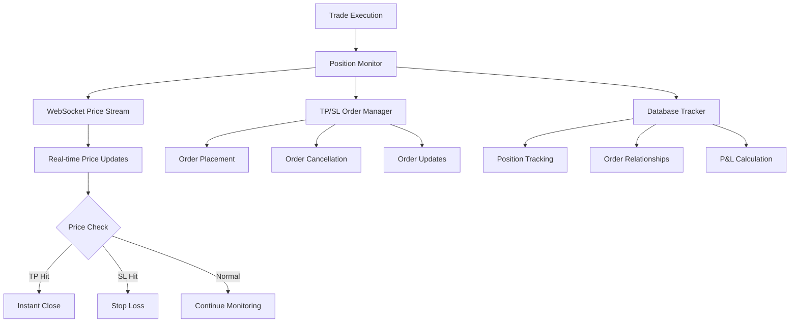

# 🎯 Position Monitor System Documentation

## Overview

The Position Monitor is an advanced position management system that provides unified TP/SL (Take Profit/Stop Loss) order management with real-time price monitoring via WebSocket. It's designed to maximize profit capture while maintaining strict risk management.

## Table of Contents

- [Architecture](#architecture)
- [Key Features](#key-features)
- [Configuration](#configuration)
- [How It Works](#how-it-works)
- [API Reference](#api-reference)
- [Implementation Details](#implementation-details)
- [Testing](#testing)
- [Troubleshooting](#troubleshooting)

---

## Architecture



## Key Features

### 1. Unified Management
- **Centralized Control**: All TP/SL orders managed from single point
- **Thread-Safe**: Re-entrant lock (RLock) protection for concurrent operations
- **Automatic Cleanup**: Handles order lifecycle automatically

### 2. Real-time Monitoring
- **WebSocket Integration**: Instant price updates
- **Immediate Execution**: No delay when profit targets hit
- **Multi-Symbol Support**: Monitor all positions simultaneously

### 3. Instant Profit Capture
- **Price Spike Detection**: Captures profits instantly when price exceeds TP
- **Market Order Execution**: Immediate fills on profit opportunities
- **Partial Fill Handling**: Manages partial position closures

### 4. Per-Tranche Management
- **Independent Tracking**: Each tranche has its own TP/SL
- **Dynamic Adjustment**: Modify orders based on market conditions
- **Merge Optimization**: Combines profitable tranches automatically

---

## Configuration

### Enable Position Monitor

```json
{
  "globals": {
    "use_position_monitor": true,
    "instant_tp_enabled": true,
    "price_monitor_reconnect_delay": 5,
    "tp_sl_batch_enabled": true
  }
}
```

### Configuration Options

| Parameter | Type | Default | Description |
|-----------|------|---------|-------------|
| `use_position_monitor` | boolean | true | Enable/disable Position Monitor |
| `instant_tp_enabled` | boolean | true | Enable instant TP on price spikes |
| `price_monitor_reconnect_delay` | integer | 5 | WebSocket reconnect delay (seconds) |
| `tp_sl_batch_enabled` | boolean | true | Batch TP/SL orders for efficiency |

### Per-Symbol Settings

```json
{
  "symbols": {
    "BTCUSDT": {
      "take_profit_enabled": true,
      "take_profit_pct": 2.0,
      "stop_loss_enabled": true,
      "stop_loss_pct": 1.0,
      "working_type": "CONTRACT_PRICE"
    }
  }
}
```

---

## How It Works

### Initialization Flow

```python
1. Bot Startup
   ├── Initialize PositionMonitor
   ├── Connect to WebSocket price stream
   ├── Load existing positions from database
   └── Start monitoring thread

2. Position Entry
   ├── Trade executed
   ├── Register with PositionMonitor
   ├── Calculate TP/SL levels
   ├── Place protective orders
   └── Start price monitoring
```

### Order Fill Handling

```python
def handle_order_fill(order_data):
    """Process when main order fills."""

    # 1. Extract order details
    symbol = order_data['symbol']
    side = order_data['side']
    quantity = order_data['executedQty']
    price = order_data['avgPrice']

    # 2. Calculate TP/SL prices
    tp_price = calculate_tp_price(price, side)
    sl_price = calculate_sl_price(price, side)

    # 3. Place protective orders
    tp_order = place_tp_order(symbol, side, quantity, tp_price)
    sl_order = place_sl_order(symbol, side, quantity, sl_price)

    # 4. Store relationships
    store_order_relationships(order_data, tp_order, sl_order)

    # 5. Start monitoring
    start_price_monitoring(symbol)
```

### Real-time Price Monitoring

```python
def monitor_prices():
    """WebSocket price monitoring loop."""

    while running:
        price_update = websocket.receive()
        symbol = price_update['symbol']
        current_price = price_update['price']

        # Check all positions for this symbol
        positions = get_positions(symbol)

        for position in positions:
            # Check if TP exceeded
            if should_take_profit(position, current_price):
                execute_instant_close(position, current_price)

            # Check if SL hit
            elif should_stop_loss(position, current_price):
                execute_stop_loss(position, current_price)
```

### Instant Profit Capture

When price exceeds take profit threshold:

```python
def execute_instant_close(position, current_price):
    """Immediately close position at market."""

    with position_lock:
        # 1. Cancel existing TP/SL orders
        cancel_tp_sl_orders(position)

        # 2. Place market close order
        close_order = place_market_order(
            symbol=position.symbol,
            side=opposite_side(position.side),
            quantity=position.quantity
        )

        # 3. Update database
        mark_position_closed(position, close_order)

        # 4. Log profit capture
        logger.success(f"Instant TP executed at {current_price}")
```

---

## API Reference

### PositionMonitor Class

```python
class PositionMonitor:
    """Unified position and TP/SL order management."""

    def __init__(self, config: dict, auth_client):
        """Initialize Position Monitor.

        Args:
            config: Bot configuration
            auth_client: Authenticated API client
        """

    def handle_order_fill(self, order_data: dict) -> bool:
        """Handle main order fill, place TP/SL.

        Args:
            order_data: Fill data from exchange

        Returns:
            True if TP/SL placed successfully
        """

    def cancel_related_orders(self, order_id: str) -> bool:
        """Cancel TP/SL orders for given main order.

        Args:
            order_id: Main order ID

        Returns:
            True if cancellation successful
        """

    def update_tp_sl(self, position_id: str,
                     tp_price: float = None,
                     sl_price: float = None) -> bool:
        """Update TP/SL for existing position.

        Args:
            position_id: Position identifier
            tp_price: New take profit price
            sl_price: New stop loss price

        Returns:
            True if update successful
        """

    def get_position_status(self, symbol: str) -> dict:
        """Get current status of all positions.

        Args:
            symbol: Trading symbol

        Returns:
            Dictionary with position details
        """
```

### Database Schema

```sql
-- Position tracking with TP/SL
CREATE TABLE position_tp_sl (
    id INTEGER PRIMARY KEY AUTOINCREMENT,
    position_id TEXT NOT NULL,
    symbol TEXT NOT NULL,
    side TEXT NOT NULL,
    quantity REAL NOT NULL,
    entry_price REAL NOT NULL,
    tp_order_id TEXT,
    tp_price REAL,
    sl_order_id TEXT,
    sl_price REAL,
    status TEXT DEFAULT 'ACTIVE',
    created_at TIMESTAMP DEFAULT CURRENT_TIMESTAMP,
    updated_at TIMESTAMP DEFAULT CURRENT_TIMESTAMP
);

-- Order relationships
CREATE TABLE order_relationships (
    main_order_id TEXT PRIMARY KEY,
    tp_order_id TEXT,
    sl_order_id TEXT,
    symbol TEXT NOT NULL,
    created_at TIMESTAMP DEFAULT CURRENT_TIMESTAMP
);
```

---

## Implementation Details

### Thread Safety

The Position Monitor uses re-entrant locks (RLock) to ensure thread safety:

```python
from threading import RLock

class PositionMonitor:
    def __init__(self):
        self._lock = RLock()  # Re-entrant lock

    def handle_order_fill(self, order_data):
        with self._lock:
            # Thread-safe operations
            self._process_fill(order_data)
            self._place_tp_sl_orders()
```

### Error Handling

```python
def place_tp_sl_with_retry(self, position, max_retries=3):
    """Place TP/SL with retry logic."""

    for attempt in range(max_retries):
        try:
            tp_order = self._place_tp_order(position)
            sl_order = self._place_sl_order(position)
            return tp_order, sl_order

        except RateLimitError:
            time.sleep(2 ** attempt)  # Exponential backoff

        except APIError as e:
            logger.error(f"API error: {e}")
            if attempt == max_retries - 1:
                raise

    return None, None
```

### WebSocket Reconnection

```python
def maintain_price_stream(self):
    """Maintain WebSocket connection with auto-reconnect."""

    while self.running:
        try:
            self._connect_websocket()
            self._subscribe_to_symbols()
            self._process_price_updates()

        except WebSocketError:
            logger.warning("WebSocket disconnected, reconnecting...")
            time.sleep(self.reconnect_delay)
```

---

## Testing

### Unit Tests

```bash
# Run Position Monitor tests
python tests/test_position_monitor.py

# Run integration tests
python tests/test_position_monitor_e2e.py

# Test with mock data
python tests/test_position_monitor_mock.py
```

### Test Scenarios

1. **Order Fill Processing**
   - Valid fill data
   - Partial fills
   - Invalid data handling

2. **TP/SL Placement**
   - Successful placement
   - API failures
   - Rate limit handling

3. **Price Monitoring**
   - TP threshold exceeded
   - SL threshold hit
   - Normal price movement

4. **Error Recovery**
   - WebSocket disconnection
   - API errors
   - Database failures

### Performance Tests

```python
def test_concurrent_positions():
    """Test handling multiple positions simultaneously."""

    monitor = PositionMonitor(config)
    positions = generate_test_positions(100)

    start_time = time.time()

    # Process positions concurrently
    with ThreadPoolExecutor(max_workers=10) as executor:
        futures = [
            executor.submit(monitor.handle_order_fill, pos)
            for pos in positions
        ]
        results = [f.result() for f in futures]

    elapsed = time.time() - start_time
    assert elapsed < 5.0  # Should process 100 positions in < 5 seconds
    assert all(results)  # All should succeed
```

---

## Troubleshooting

### Common Issues

#### 1. TP/SL Orders Not Placing

**Problem**: Orders fail to place after main order fills

**Solutions**:
- Check `use_position_monitor` is `true` in settings
- Verify API permissions include trading
- Check rate limits aren't exceeded
- Ensure sufficient balance for fees

#### 2. WebSocket Disconnections

**Problem**: Price monitoring stops working

**Solutions**:
- Check internet stability
- Increase `price_monitor_reconnect_delay`
- Monitor logs for connection errors
- Verify WebSocket URL is correct

#### 3. Instant TP Not Triggering

**Problem**: Price exceeds TP but position doesn't close

**Solutions**:
- Verify `instant_tp_enabled` is `true`
- Check WebSocket is receiving price updates
- Ensure position is registered with monitor
- Check logs for execution errors

### Debug Mode

Enable debug logging for Position Monitor:

```python
# In your config or environment
import logging
logging.getLogger('position_monitor').setLevel(logging.DEBUG)
```

### Monitor Status Check

```python
# Check Position Monitor status
def check_monitor_health():
    """Health check for Position Monitor."""

    status = {
        'websocket_connected': monitor.ws_connected,
        'active_positions': len(monitor.positions),
        'pending_orders': len(monitor.pending_orders),
        'last_update': monitor.last_update_time,
        'errors': monitor.error_count
    }

    return status
```

---

## Best Practices

### 1. Configuration
- Start with conservative TP/SL percentages
- Enable `instant_tp` for volatile markets
- Use `CONTRACT_PRICE` for more accurate triggers

### 2. Monitoring
- Regularly check Position Monitor logs
- Monitor WebSocket connection status
- Track TP/SL hit rates for optimization

### 3. Risk Management
- Always set both TP and SL
- Don't disable Position Monitor during trades
- Test thoroughly in simulation mode first

### 4. Performance
- Batch TP/SL orders when possible
- Limit number of concurrent positions
- Monitor system resource usage

---

## Migration Guide

### From Legacy TP/SL System

```bash
# 1. Backup database
cp bot.db bot_backup.db

# 2. Run migration script
python scripts/migrate_to_position_monitor.py

# 3. Update configuration
# Set use_position_monitor: true

# 4. Restart bot
python launcher.py
```

### Verification Steps

```bash
# Verify migration success
python scripts/verify_position_protection.py

# Check for unprotected positions
python scripts/emergency_tp_sl_placement.py --check-only

# Test in simulation mode first
# Set simulate_only: true
```

---

## Future Enhancements

### Planned Features
- Dynamic TP/SL adjustment based on volatility
- Multiple TP levels (scaling out)
- Trailing stop loss
- OCO (One-Cancels-Other) order support
- Advanced order types (Iceberg, etc.)

### Performance Improvements
- Order caching for faster updates
- Batch WebSocket subscriptions
- Optimized database queries
- Memory usage optimization

---

<p align="center">
  <b>Position Monitor - Protecting Your Profits 24/7! 🛡️</b>
</p>